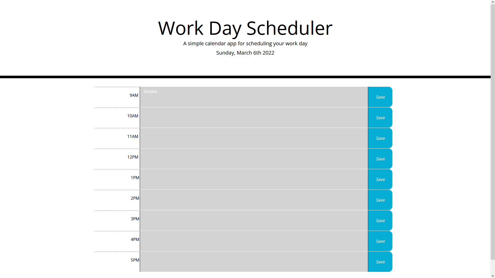

# Work Day Scheduler Project

## Website Link

Website link -

# About the Project

This project helps tackle the overwhelming tasks we deal with every day by providing color-coded hours of present, past, and future colors while also allowing the user to save their task without fear of it being erased after refreshing the page.

# Overview

## Frontend Function Description

### Color Code Time

Between 9AM and 5PM the text-area blocks will change colors according to the time. It's able to do this by using some backend functions that will be explained in another section. But whenever you open the website up, it'll take your local time and it'll change the color blocks. Below are the three colors you'll see.

- Green - This time block is in the future
- Red - Currently this hour
- Grey - Time has past this time block

### Save Function

Next to the time block are also save buttons where if you click on them, it'll hover indicating you can click to save the task in the time block that is being hover. Click once and it'll automatically be stored in your local storage.

## Backend Description

### JQuery

Looking at the backend of the code, you'll notice that it is being powered by JQuery. This is to make the code easier to read and get rid of repeating tasks when it can be all done by one line of code

### Time Blocks

To create every time block, I use a for loop to create a row that'll create the sections the same as the screenshot. They are mainly created by using one line but for the text area, it uses if statements and will assign the right CSS color according to time.

Another function looks through the user's local storage so if any previous task was saved, the user can come back to it and find their task still there.

### Save Function

Creating the save button creates an onClick function with it as well. What it does is that it'll listen for a click and once click, it'll call the `saveBtnFun` function, get the correct time block id, and save the value into their local storage. If the text area is empty, it'll completely erase the value from their storage so it doesn't take up any space.

# Author

Andrew Banagas
